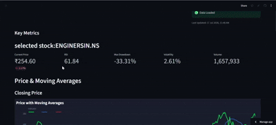
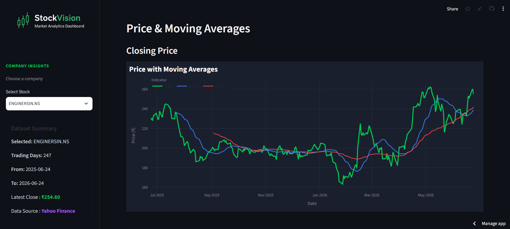
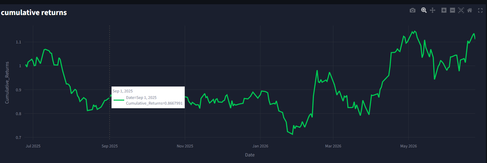
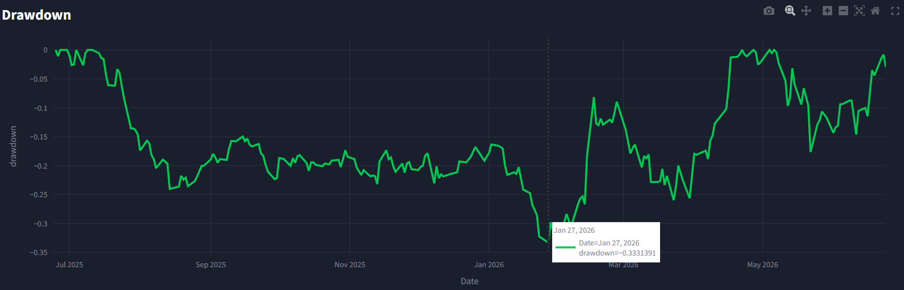

# StockVision – Financial Analytics Dashboard

> **An interactive financial analytics platform built with Python and Streamlit to analyze historical stock market data using Exploratory Data Analysis (EDA), technical indicators, and interactive visualizations.**

<p align="center">


</p>

---

#  Project Overview

StockVision is an end-to-end financial analytics dashboard designed to transform historical stock market data into meaningful insights through data cleaning, exploratory data analysis (EDA), financial KPI analysis, and interactive visualizations.

The platform enables users to explore stock performance, identify market trends, evaluate technical indicators, and support data-driven investment analysis through an intuitive Streamlit interface.


#  Features

###  Financial Analytics

* Historical Stock Price Analysis
* Daily & Cumulative Returns
* Rolling Volatility Analysis
* Moving Averages (50 & 200)
* Relative Strength Index (RSI)
* Maximum Drawdown Analysis
* Volume Trend Analysis


###  Interactive Dashboard

* Interactive Plotly Charts
* Dynamic KPI Cards
* Dark Theme UI
* Company Information Panel
* Sidebar Controls
* Responsive Layout


###  Data Processing

* Historical Data Collection using Yahoo Finance
* Data Cleaning
* Missing Value Handling
* Duplicate Detection
* Feature Engineering
* Financial KPI Calculation
* Exploratory Data Analysis (EDA)


# 🛠️ Tech Stack

| Category        | Technologies             |
| --------------- | ------------------------ |
| Programming     | Python                   |
| Data Analysis   | Pandas, NumPy            |
| Visualization   | Plotly                   |
| Dashboard       | Streamlit                |
| Data Source     | Yahoo Finance (yfinance) |
| Version Control | Git, GitHub              |


#  Project Structure

```text
StockVision/
│
├── assets/
│
├── data/
│
├── notebooks/
│
├── src/
│
├── app.py
├── requirements.txt
├── style.css
├── README.md
└── LICENSE
```


---
#  Dashboard Preview

> 

---


### Stock Performance






#  Key Performance Metrics

The dashboard provides insights into:

* Stock Price Trends
* Daily Returns
* Cumulative Returns
* Market Volatility
* RSI
* Moving Averages
* Trading Volume
* Drawdown Analysis


#  Getting Started

### Clone Repository

```bash
git clone https://github.com/yourusername/StockVision.git
```


### Install Requirements

```bash
pip install -r requirements.txt
```


### Run Application

```bash
streamlit run app.py
```


# Workflow

```text
Yahoo Finance
        │
        ▼
Data Collection
        │
        ▼
Data Cleaning
        │
        ▼
Feature Engineering
        │
        ▼
Exploratory Data Analysis
        │
        ▼
Financial KPI Analysis
        │
        ▼
Interactive Dashboard
```


# 📚 Skills Demonstrated

* Financial Data Analysis
* Exploratory Data Analysis (EDA)
* Data Cleaning
* Feature Engineering
* Financial KPI Analysis
* Data Visualization
* Dashboard Development
* Python Programming
* Streamlit Development
* Plotly Visualization
* Git & GitHub


#  Future Enhancements (V2)

* PostgreSQL Integration
* Power BI Dashboard
* Automated ETL Pipeline
* Multi-Stock Comparison
* Portfolio Performance Analysis
* Advanced Business KPI Reporting
* Export Reports (CSV/PDF)

---

# 👨‍💻 Author

**Vanshika Negi**

📧 Email: [vanshikanegi266@gmail.com](mailto:vanshikanegi266@gmail.com)

🔗 LinkedIn: *(Add Profile)*

💻 GitHub: [https://github.com/Van004-ds](https://github.com/Van004-ds)

---

# ⭐ If you found this project useful, consider giving it a star!

